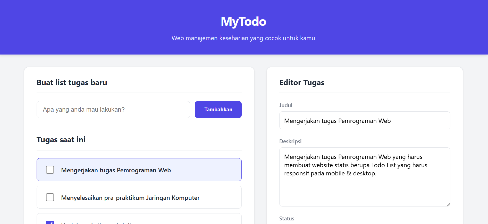
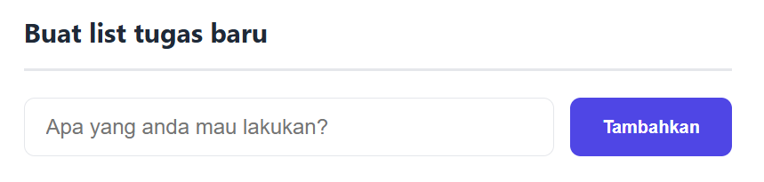
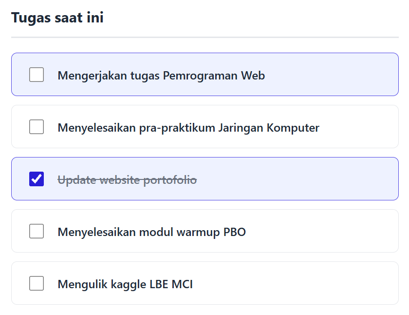
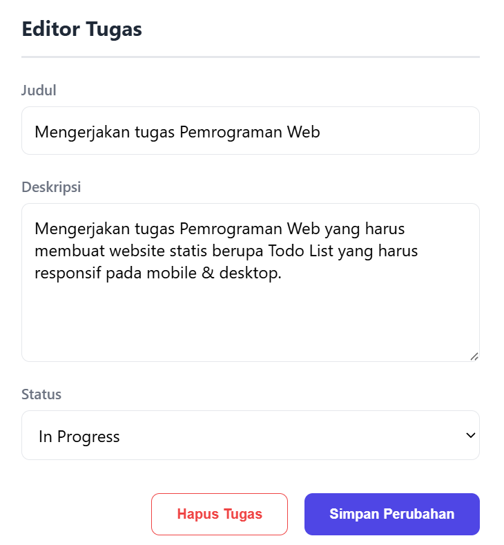

# 5025251100_Todo-App
Static web for Todo list, 2nd task for Pemrograman Web class course

## Identitas

|    NRP     |         Nama          |    Kelas    |
| :--------: | :-------------------: | :---------: |
| 5025251100 | Yudith Hafiz Rabbani  |      A      |

## Deskripsi

### Gambaran Umum

MyTodo adalah antarmuka manajemen tugas (Todo List) statis berbasis HTML5 semantik dan CSS3 murni. Aplikasi ini mengusung pola tata letak dua panel (two-panel layout) yang responsif, memisahkan navigasi daftar tugas dengan panel editor detail tanpa bergantung pada framework eksternal. 

### Struktur File

Proyek ini terdiri dari dua file utama yang saling terpisah antara struktur data dan gaya visual:

- index.html: Memuat seluruh elemen DOM dan penandaan semantik.

- style.css: Menyimpan variabel warna, tata letak Flexbox, dan aturan responsive breakpoint.

### Fitur Antarmuka

#### 1. Form Pembuatan Tugas
Komponen form independen di bagian atas panel kiri yang memungkinkan pengguna memasukkan judul tugas baru melalui input teks terintegrasi dan tombol penambahan (Tambahkan).

#### 2. Daftar Tugas
Komponen yang menampilkan tugas terkini dengan fitur visual status checkbox dan indikator aktif.

#### 3. Panel Editor
Komponen form yang menjadi penyunting interaktif yang memuat field judul, area deskripsi, selektor status, dan tombol hapus maupun simpan.

## Preview Todo App

### Preview Fitur Create

### Preview Fitur List

### Preview Fitur Editor

### URL Website
[Klik disini](https://if-pemrograman-web-a.github.io/5025251100_Todo-App/)