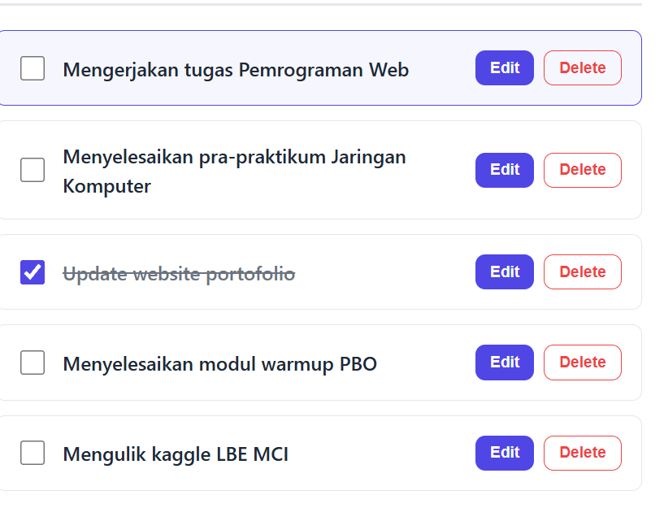

# 5025251100_Todo-App
Static web for Todo list, 2nd task for Pemrograman Web class course

## Identitas

|    NRP     |         Nama          |    Kelas    |
| :--------: | :-------------------: | :---------: |
| 5025251100 | Yudith Hafiz Rabbani  |      A      |

## Deskripsi

### Gambaran Umum

MyTodo adalah antarmuka manajemen tugas (Todo List) berbasis HTML5, JavaScript,  dan CSS3 . Aplikasi ini mengusung pola tata letak dua panel (two-panel layout) yang responsif, memisahkan navigasi daftar tugas dengan panel editor detail tanpa bergantung pada framework eksternal. Selain itu aplikasi ini juga memiliki toggle dark/light untuk mengatur kesesuaian pengguna dengan background. 

### Struktur File

Proyek ini terdiri dari dua file utama yang saling terpisah antara struktur data dan gaya visual:

- index.html: Struktur dan antarmuka halaman web.

- style.css: Menyimpan variabel warna, tata letak Flexbox, dan aturan responsive breakpoint.

- script.js: Logika memanipulasi DOM, manajemen state tugas, dan fungsionalitas ganti tema

### Fitur Antarmuka

#### 1. Form Pembuatan Tugas
Komponen form independen di bagian atas panel kiri yang memungkinkan pengguna memasukkan judul tugas baru melalui input teks terintegrasi dan tombol penambahan (Tambahkan).

#### 2. Daftar Tugas
Komponen yang menampilkan tugas terkini dengan fitur visual status checkbox dan indikator aktif.

#### 3. Panel Editor
Komponen form yang menjadi penyunting interaktif yang memuat field judul, area deskripsi, selektor status, dan tombol hapus maupun simpan.

#### 4. Toggle Light/Dark Button
Komponen tembol yang mampu mengganti tema latar belakang aplikasi menjadi cerah/gelap sesuai dengan preferensi pengguna

## Preview Todo App

### Preview Fitur Create (New Sekarang bisa dipakai walau belum persistent)

### Preview Fitur List

### Preview Fitur Editor

### Preview Toggle Light/Dark (New)

### Preview Edit/Delete (New)

### URL Website
[Klik disini](https://if-pemrograman-web-a.github.io/5025251100_Todo-App/)